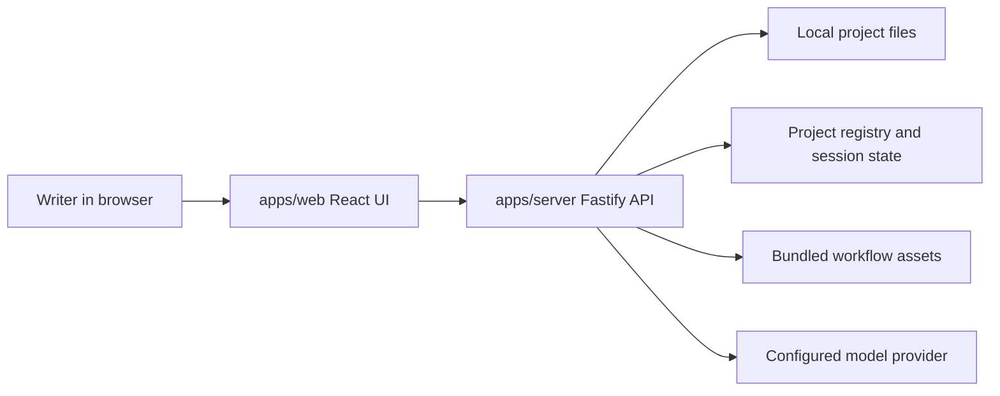

# Architecture Overview

AuctorForge is a local-first writing workbench built as a pnpm workspace.

## Workspace Layout

- `apps/web`: Vite + React application for the launcher, workbench, editor, file tree, chat panel, workflow rail, and model settings UI
- `apps/server`: Fastify API server for project management, file access, workflow state, chat turns, model settings, and local proposal generation
- `packages/shared`: shared TypeScript contracts used by the web app and server
- `skill-packs`: bundled workflow assets used to initialize and guide writing projects
- `openspec`: OpenSpec change records for behavior-changing product work
- `tests/e2e`: Playwright browser smoke tests

## Runtime Shape



The web app is the user-facing workbench. It talks to the API server over local HTTP endpoints. The server owns filesystem access and keeps project-specific runtime state separate from UI state.

## Web App

Important feature areas:

- `features/startup`: launcher, recent projects, project creation/import, and project switching
- `features/workbench`: high-level workbench composition
- `features/editor`: manuscript/document editor state
- `features/files`: grouped project file navigation
- `features/chat`: assistant chat, streaming state, and chat session calls
- `features/workflow`: workflow progress and current writing step
- `features/settings`: model-provider settings
- `features/navigation`: route state and compatibility routing

## Server

The server entry point is `apps/server/src/index.ts`, which creates the Fastify app from `apps/server/src/api/createApp.ts`.

Main API areas:

- `/api/projects*`: project registry, creation, import, open, archive, remove, and repair
- `/api/file*` and `/api/files*`: local project file reads, writes, and tree listing
- `/api/session` and `/api/chat/session`: project session state
- `/api/chat` and `/api/chat/stream`: assistant turns and streaming chat
- `/api/settings/model*`: model configuration and provider checks
- `/api/progress`: workflow progress
- `/api/workspace/init`: project initialization

Core server modules are organized by responsibility:

- `core/projects`: project registry, lifecycle, manifest, active context, and summaries
- `core/files`: project initialization, safe file access, tree listing, and workflow-file sync
- `core/chat`: prompt construction, turn planning, assistant proposals, session storage, and discussion replies
- `core/workflow`: workflow contracts, state machine, and soft-flow policy
- `core/memory`: structured project memory and context assembly
- `core/settings`: model configuration
- `core/write`, `core/review`, `core/quality`, `core/analyze`, `core/guide`: writing and review workflow helpers

## Data And Safety Boundaries

- Project files live on the user's machine.
- Browser code should not access arbitrary local paths directly; it goes through server APIs.
- Server file APIs should keep writes inside the active project boundary.
- Model-provider calls should be explicit and understandable to the writer.
- Secrets belong in local configuration, never committed files.

## OpenSpec Usage

Use OpenSpec when a change affects product behavior, workflow behavior, compatibility, data flow, or user-facing UI behavior.

Examples that should use OpenSpec:

- changing project initialization
- changing model-request behavior
- adding export or backup controls
- adding sample-project behavior
- changing assistant workflow rules

Examples that usually do not need OpenSpec:

- README edits
- issue templates
- release checklists
- typo fixes
- supplementary examples that do not affect runtime behavior

## Verification

Common verification commands:

```bash
openspec validate --all
pnpm test
pnpm build
pnpm test:e2e
```
