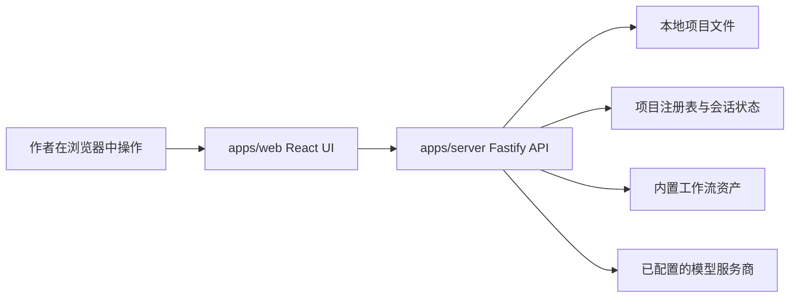

# 架构概览 / Architecture Overview

AuctorForge 是一个本地优先写作工作台，代码组织为 pnpm workspace。

## Workspace 结构

- `apps/web`：Vite + React 应用，包含启动页、工作台、编辑器、文件树、助手对话、流程栏和模型设置界面
- `apps/server`：Fastify API 服务，负责项目管理、文件访问、流程状态、对话轮次、模型设置和本地提案生成
- `packages/shared`：Web 与 Server 共用的 TypeScript 契约
- `skill-packs`：初始化和引导写作项目的内置工作流资产
- `openspec`：记录会改变产品行为的 OpenSpec change
- `tests/e2e`：Playwright 浏览器冒烟测试

## 运行时形态



Web 应用是用户看到的工作台，通过本地 HTTP 接口与 API 服务通信。Server 负责文件系统访问，并把项目运行态与 UI 状态分开管理。

## Web 应用

主要功能区域：

- `features/startup`：启动页、最近项目、新建/导入项目、项目切换
- `features/workbench`：工作台整体组合
- `features/editor`：稿件/文档编辑状态
- `features/files`：分组项目文件导航
- `features/chat`：助手对话、流式状态、会话 API
- `features/workflow`：流程进度与当前写作步骤
- `features/settings`：模型服务商设置
- `features/navigation`：路由状态与兼容路由

## Server

服务入口是 `apps/server/src/index.ts`，它从 `apps/server/src/api/createApp.ts` 创建 Fastify app。

主要 API：

- `/api/projects*`：项目注册表、新建、导入、打开、归档、移除、修复
- `/api/file*` 和 `/api/files*`：本地项目文件读取、写入、文件树列表
- `/api/session` 和 `/api/chat/session`：项目会话状态
- `/api/chat` 和 `/api/chat/stream`：助手轮次和流式对话
- `/api/settings/model*`：模型配置与连接检查
- `/api/progress`：流程进度
- `/api/workspace/init`：项目初始化

核心模块按职责组织：

- `core/projects`：项目注册表、生命周期、manifest、active context、项目摘要
- `core/files`：项目初始化、安全文件访问、文件树、工作流文件同步
- `core/chat`：提示词构建、轮次规划、助手提案、会话存储、讨论回复
- `core/workflow`：流程契约、状态机、soft-flow 策略
- `core/memory`：结构化项目记忆与上下文组装
- `core/settings`：模型配置
- `core/write`、`core/review`、`core/quality`、`core/analyze`、`core/guide`：写作与审查工作流辅助

## 数据与安全边界

- 项目文件保存在用户机器上。
- 浏览器代码不直接访问任意本地路径，而是通过 server API。
- Server 文件 API 应把写入限制在当前项目边界内。
- 模型服务商调用应对作者明确、可理解。
- 密钥属于本地配置，不应提交进仓库。

## OpenSpec 使用

当变更影响产品行为、写作流程、兼容性、数据流或用户可见 UI 行为时，应使用 OpenSpec。

应使用 OpenSpec 的例子：

- 修改项目初始化
- 修改模型请求行为
- 增加导出或备份控制
- 增加示例项目行为
- 修改助手工作流规则

通常不需要 OpenSpec 的例子：

- README 修改
- Issue 模板
- 发布清单
- 错别字修复
- 不影响运行时行为的补充示例

## 验证

常用验证命令：

```bash
openspec validate --all
pnpm test
pnpm build
pnpm test:e2e
```
