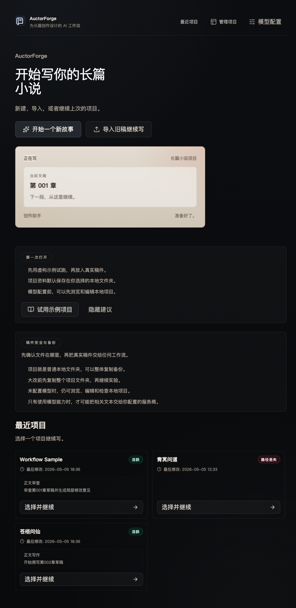
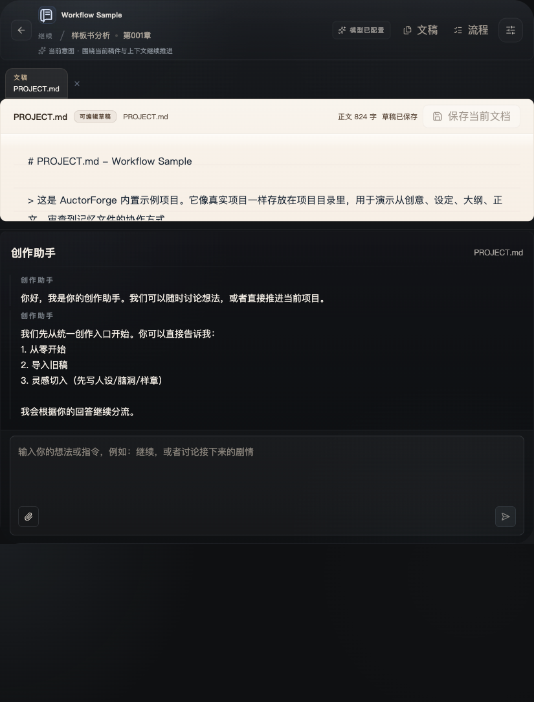

# 小说创作新手教程：从一个想法到第一章

这是一份真正给新手的教程。你不需要先懂术语，也不需要先会大纲理论。你只要照着做，就能从一个想法，写出第一章的草稿。

建议边看边做。每一步都先完成，再往下走。

## 第 1 步：打开首页，先确定你要写哪个故事



打开 AuctorForge 首页，先不要急着写正文。你只需要先确定一件事：

**你今天要写的是哪一个故事。**

如果你还没有现成项目，先点 **试用示例项目**，熟悉整个流程。
如果你已经有想法，也可以直接新建项目，但第一步仍然一样：先把灵感说清楚。

### 这一页你要做的事

- 看懂首页上的入口
- 知道从哪里开始
- 选择示例项目或新项目

## 第 2 步：把灵感写成一句话

很多新手卡住，是因为脑子里有画面，但没有故事。

先写这个句式：

```text
一个【谁】在【什么处境】下，因为【什么事件】，不得不去做【什么事】，但【什么阻碍】不断出现。
```

### 示例

```text
一个外卖骑手在雨夜听见破手机里的求救声，不得不追查白塔仓库，但城市里有人也在抢这条线索。
```

### 你现在就写

把你的故事压成一句话，先别管写得好不好。

| 项目 | 你的内容 |
| --- | --- |
| 主角是谁 |  |
| 主角在哪里 |  |
| 发生了什么事 |  |
| 主角要去做什么 |  |
| 最大阻碍是什么 |  |

写完后，把这一句话留着，后面每一步都围绕它展开。

## 第 3 步：确定主角

你只需要把主角讲清楚，不用把所有配角都想完。

### 主角卡

| 项目 | 你先写什么 | 示例 |
| --- | --- | --- |
| 姓名 |  | 林澈 |
| 身份 |  | 外卖骑手 |
| 当前困境 |  | 钱紧、很累、赶时间 |
| 想要什么 |  | 查清手机里的声音来源 |
| 害怕什么 |  | 被卷进更大的麻烦 |
| 能力或资源 |  | 能听见物品残留的声音 |
| 代价 |  | 用多了会头痛 |

### 你现在就写

先把主角卡填满，不要追求完整，只要能动笔。

如果你发现主角什么都没有，那就先给他一个最简单的愿望，比如：

- 想活下去
- 想找到失踪的人
- 想赚够钱
- 想知道真相
- 想保护某个人

## 第 4 步：写出第一章要发生的事

第一章不要讲完全部世界，只要发生一件“打破日常”的事。

### 第一章三件事

| 顺序 | 你要写什么 | 示例 |
| --- | --- | --- |
| 1 | 主角在做什么 | 雨夜送外卖，电梯坏了 |
| 2 | 什么事打断了日常 | 破手机突然发出声音 |
| 3 | 主角做了什么选择 | 他把手机带走，开始追查 |

### 第一章章节卡

| 模块 | 你要写什么 |
| --- | --- |
| 开场 | 主角正在做一件具体的事 |
| 压力 | 主角为什么不能掉头就走 |
| 异常 | 有什么不该发生的事发生了 |
| 行动 | 主角决定怎么做 |
| 钩子 | 这一章最后留下什么问题 |

### 示例

| 模块 | 示例 |
| --- | --- |
| 开场 | 雨夜送外卖，爬楼送餐 |
| 压力 | 超时会扣钱，主角很缺钱 |
| 异常 | 楼道里的一部旧手机说话了 |
| 行动 | 主角把手机带走，去查号码 |
| 钩子 | 手机再次响起，传来更危险的线索 |

## 第 5 步：先写第一章骨架

现在不要写华丽句子，先写骨架。

按这个顺序写：

1. 主角出现。
2. 主角在做一件具体的事。
3. 有压力压着他。
4. 异常出现。
5. 主角做选择。
6. 选择带来麻烦。
7. 章末留问题。

### 第一章骨架示例

```text
雨下了很久。

林澈送外卖上楼，电梯坏了，只能爬楼。

他刚到楼道拐角，就听见一部旧手机在响。

手机里传出一句断断续续的话：别去白塔仓库。

林澈本来想走，但他还是把手机捡了起来。
```

### 你现在就写

先写 5 到 8 行，能把事情说清楚就行。不要着急修辞。

## 第 6 步：用工作台把内容整理起来

写到这里，你已经有了第一章的骨架。接下来回到 AuctorForge，把内容整理到项目里。



在工作台里，你可以：

- 把一句话故事写进项目文件
- 把主角卡拆成独立文档
- 把第一章骨架放进章节文件
- 用创作助手帮你检查“主角目标是否清楚”
- 继续补冲突和钩子

如果你看不懂该往哪写，就先看左边的文稿，再看右边的创作助手。

## 第 7 步：把故事变得更像“第一章”

很多新手写完后，第一章会出现两个问题：

- 只有设定，没有事。
- 只有事，没有压力。

你可以直接问自己三个问题：

1. 主角这章想要什么？
2. 是什么拦住他？
3. 章末留了什么新问题？

如果这三个问题都能回答，这章就已经像第一章了。

## 第 8 步：最简单的修改方法

先只改三件事：

- 开头有没有场景感
- 主角有没有主动做选择
- 结尾有没有钩子

不要一开始就全篇重写。

### 修改检查表

| 检查项 | 是/否 |
| --- | --- |
| 开头是不是具体场景 |  |
| 主角有没有明确目标 |  |
| 有没有打断日常的异常 |  |
| 主角有没有采取行动 |  |
| 结尾有没有新问题 |  |

## 第 9 步：你已经完成了什么

你现在已经完成了：

- 一个故事想法
- 一个主角
- 第一章的骨架
- 第一章的开头方向

接下来再往前走，就是把骨架填成完整草稿。

## 第 10 步：下一步怎么继续

如果你想继续，可以：

- 回到主角卡补细节
- 给第一章加一个更强的冲突
- 写第二章要接什么
- 进入 AuctorForge 继续整理和修改

这份教程先带你写出第一章。等第一章写出来，再去扩展世界观和长篇结构，会轻松很多。

### 这份教程里你会看到的图

- 首页图：告诉你从哪里开始
- 工作台图：告诉你写完以后放到哪里

截图不会替你写作，但会帮你知道每一步应该在哪个界面完成。
