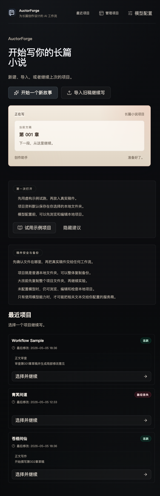
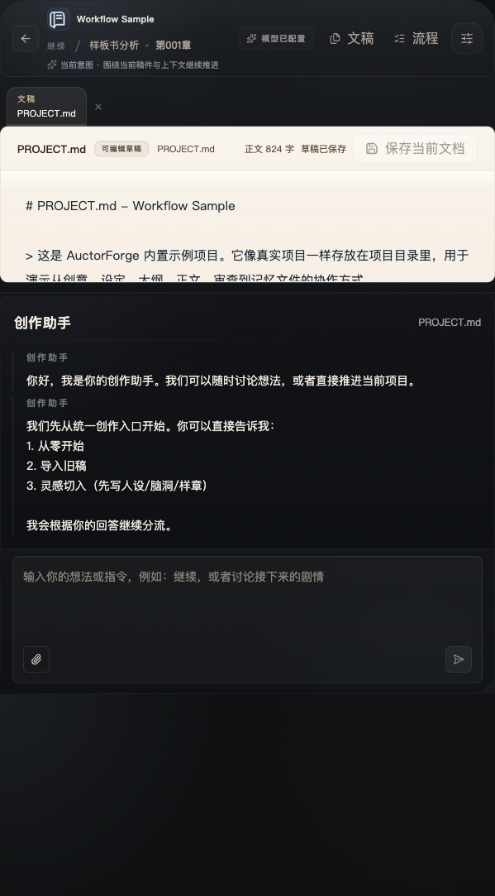
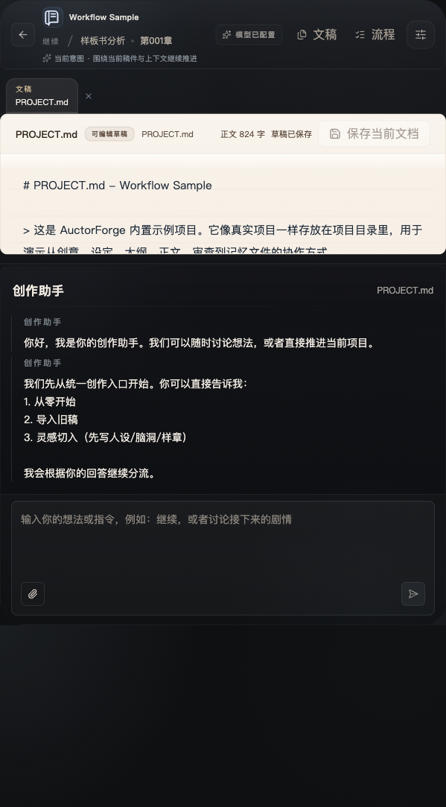
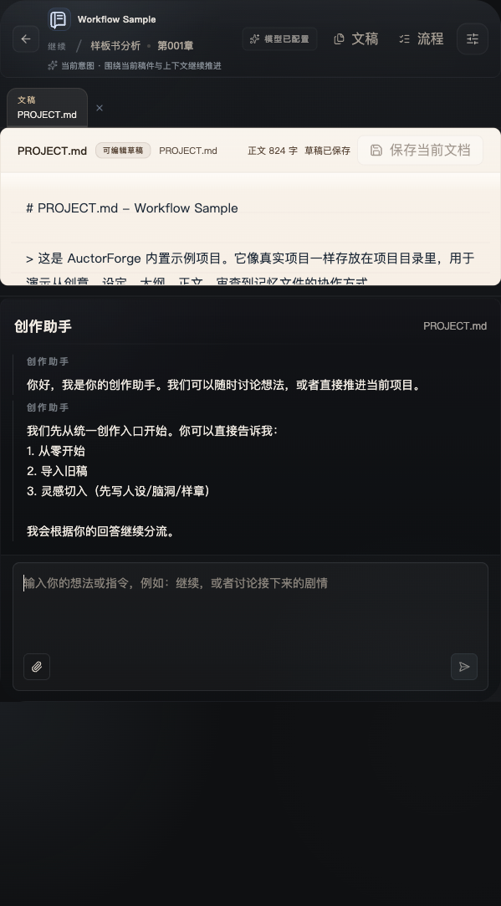
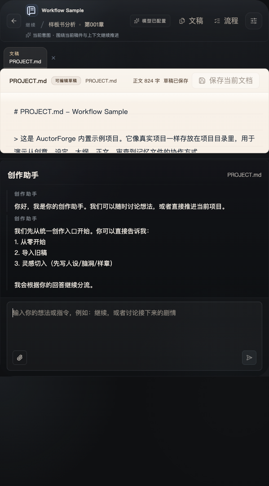
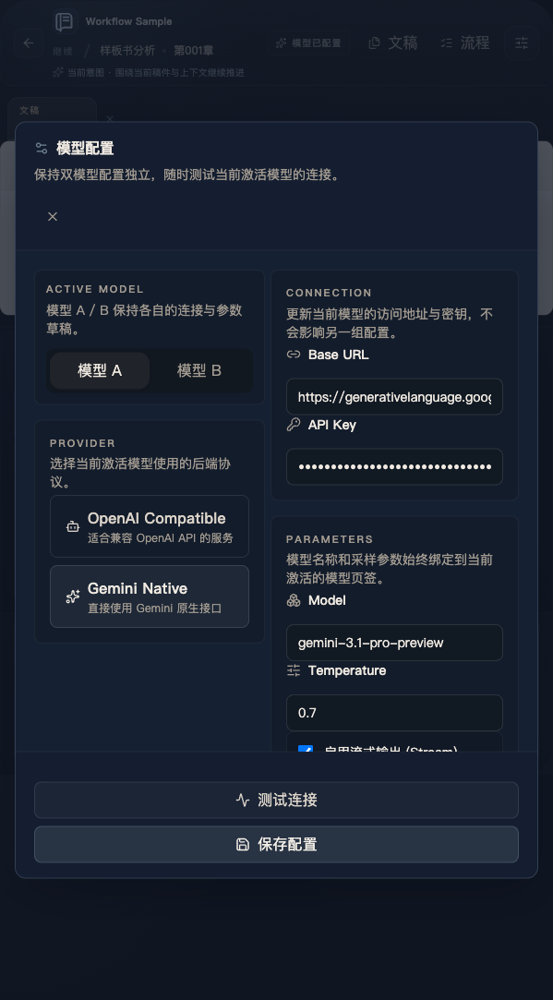
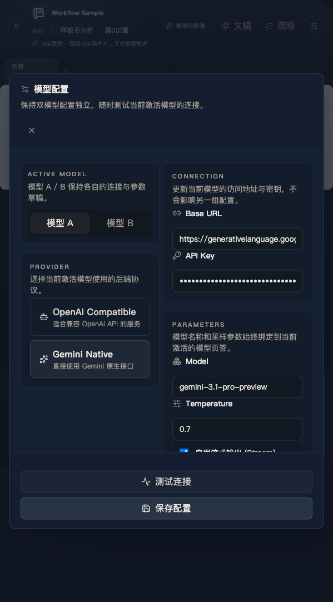

# 小说创作新手教程：从一个想法到第一章

这是一份给纯新手的手把手教程。你不需要先懂写作术语，也不需要一开始想完整本书。照着 10 个步骤做，你会得到：

- 一个清楚的故事想法
- 一个能行动的主角
- 一张第一章章节卡
- 一段第一章骨架
- 一份可以继续扩写的第一章草稿

每一步都有一张图。先看图，再完成本步练习。

## 第 1 步：打开首页，选一个开始方式



先打开 AuctorForge 首页。新手建议点 **试用示例项目**，先用虚构内容练习，不要一开始就导入真实稿件。

这一页你只做一件事：确定今天要写哪个故事。

写下来：

```text
我今天要写的故事是：
```

## 第 2 步：进入示例项目，看懂工作台


进入项目后，你会看到左边是文稿，右边是创作助手。

新手先记住这个分工：

- 左边：放你的故事资料和草稿
- 右边：问问题、整理想法、检查内容

现在先不要改很多东西，只要看懂项目大概是什么。

## 第 3 步：把灵感写成一句话



把灵感压成一句话。不要追求文采，先追求清楚。

使用这个句式：

```text
一个【谁】在【什么处境】下，因为【什么事件】，不得不去做【什么事】，但【什么阻碍】不断出现。
```

示例：

```text
一个外卖骑手在雨夜听见破手机里的求救声，不得不追查白塔仓库，但城市里有人也在抢这条线索。
```

你现在填写：

| 问题 | 你的答案 |
| --- | --- |
| 主角是谁 |  |
| 主角在哪里 |  |
| 发生了什么事 |  |
| 主角要做什么 |  |
| 谁或什么在阻碍主角 |  |

## 第 4 步：把一句话放进项目文稿



把上一步的一句话写进项目文稿。它会成为你后面所有内容的方向。

建议放成这样：

```text
## 故事核心

一句话故事：

主角：

主角目标：

主要阻碍：
```

新手不要急着补世界观。先把这四项写清楚。

## 第 5 步：用创作助手检查主角



现在看右侧创作助手。你可以让它帮你检查，而不是直接替你写。

推荐输入：

```text
请根据我的一句话故事，帮我检查主角目标是否清楚。只给建议，不要替我写正文。
```

你要看它回答三件事：

- 主角想做什么是否清楚
- 阻碍是否具体
- 第一章能不能从这里开始

如果回答太宽泛，就继续问：

```text
请把建议缩短成 3 条，每条都能直接修改我的故事。
```

## 第 6 步：写第一章章节卡



第一章不要讲完整个世界。第一章只要让一件事发生。

填写这张章节卡：

| 模块 | 你要写什么 | 示例 |
| --- | --- | --- |
| 开场 | 主角正在做一件具体的事 | 雨夜送外卖，爬楼送餐 |
| 压力 | 主角为什么不能掉头就走 | 超时会扣钱，主角很缺钱 |
| 异常 | 打破日常的事件 | 楼道里的旧手机说话了 |
| 行动 | 主角做出的选择 | 主角把手机带走 |
| 钩子 | 章末留下的新问题 | 手机再次响起，传来新线索 |

这张表填完，你就知道第一章该写什么了。

## 第 7 步：确认模型和隐私边界



如果你要让 AI 帮你检查或整理，请先确认模型配置。

新手记住：

- 没配置模型时，也可以编辑本地文稿
- 调用远程模型时，相关文本可能发送给服务商
- 第一次练习请用虚构内容

如果你不确定，就先不要放真实未公开稿件。

## 第 8 步：打开文稿导航，整理你的材料


写第一章前，把材料分清楚。新手可以先准备 4 个部分：

```text
故事核心
主角卡
第一章章节卡
第一章草稿
```

这样做的好处是：你不会把设定、人物、正文全混在一起。

## 第 9 步：打开流程状态，确认下一步


流程状态用来提醒你现在处于哪一步。

写第一章时，你只需要关心这个顺序：

1. 整理灵感
2. 确定主角
3. 拆第一章
4. 写第一章骨架
5. 修改第一章

不要同时做太多事。一次只推进一个小步骤。

## 第 10 步：写出第一章骨架，然后继续



现在开始写第一章骨架。先写 5 到 8 行，不要追求完美。

示例：

```text
雨下了很久。

林澈送外卖上楼，电梯坏了，只能爬楼。

他刚到楼道拐角，就听见一部旧手机在响。

手机里传出一句断断续续的话：别去白塔仓库。

林澈本来想走，但他还是把手机捡了起来。
```

写完后，用这张检查表看一遍：

| 检查项 | 是/否 |
| --- | --- |
| 开头是不是具体场景 |  |
| 主角有没有明确目标 |  |
| 有没有打断日常的异常 |  |
| 主角有没有采取行动 |  |
| 结尾有没有新问题 |  |

如果 5 项里有 3 项以上是“是”，你就已经完成第一章的起步了。

## 完成后你应该得到什么

照着这 10 步做完，你至少会有：

- 一句话故事
- 主角卡
- 第一章章节卡
- 第一章骨架
- 第一章修改检查表

这就够了。新手最重要的不是一口气写完整本书，而是先写出可以继续修改的第一章。
