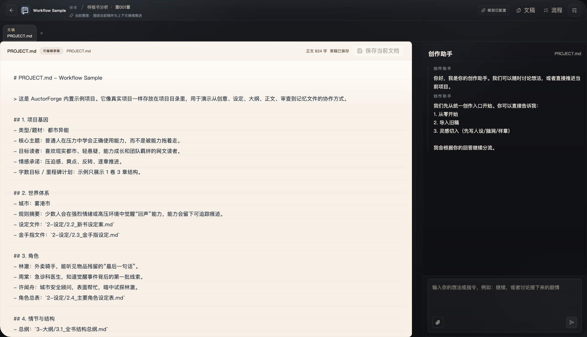
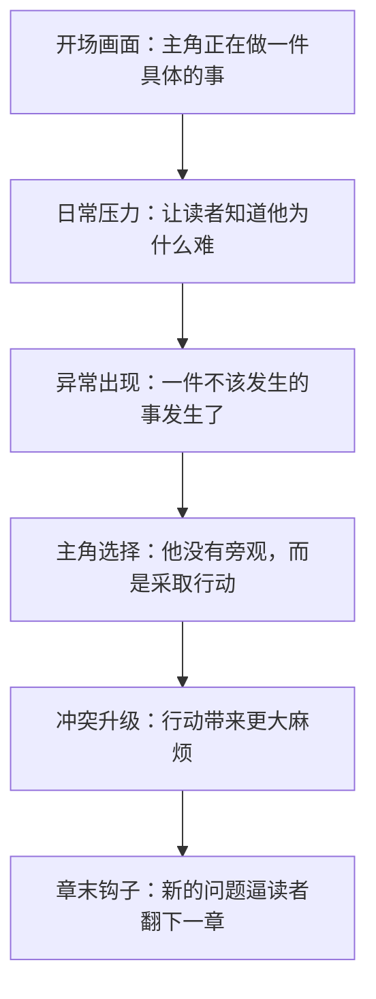

# 小说创作新手教程：从一个想法到第一章

这份教程写给刚开始创作小说的新手作者。你不需要先懂复杂理论，也不需要一开始就想清楚整本书。目标只有一个：把一个模糊灵感，变成可以动笔的故事方案，并写出第一章草稿。

如果你正在使用 AuctorForge，可以把本文当作创作路线图：先在纸上或 `PROJECT.md` 里完成每一步，再用工作台整理资料、和创作助手讨论、逐步修改。



## 0. 新手最容易卡在哪里

很多新手不是不会写句子，而是不知道下一步该写什么。常见卡点有：

- 只有一个很酷的设定，但不知道主角要做什么。
- 想写大长篇，却没有第一章的具体场景。
- 人物很多，但每个人都像设定表，没有行动。
- 开头铺设太久，读者看不到冲突。
- 一边写一边推翻，越改越焦虑。

解决办法不是先补一百页设定，而是先搭出一个最小可写结构。


这一套流程不追求完美，只追求让你能开始写。

## 1. 把灵感变成一句话故事

灵感通常很散，比如：

- 一个能听见旧物记忆的外卖骑手。
- 一个被师门放弃的杂役弟子。
- 一个重生后不想复仇，只想开店的人。
- 一个每天醒来都会换一种身份的少女。

这些灵感还不是故事。故事至少要回答：谁，想要什么，遇到什么阻碍，最后会走向什么变化。

### 一句话故事公式

```text
一个【身份/处境】的主角，因为【引爆事件】，不得不【目标行动】，但【主要阻碍】不断逼近，最终他/她/他们必须【做出选择或完成改变】。
```

### 示例

```text
一个疲惫的外卖骑手，因为在雨夜听见破手机里残留的求救声，不得不追查白塔仓库的秘密，但城市安全顾问和觉醒者组织都在抢夺线索，最终他必须学会正确使用自己的能力，而不是被能力拖着走。
```

### 练习

| 问题 | 你的答案 |
| --- | --- |
| 主角是谁？ |  |
| 主角现在最想要什么？ |  |
| 什么事件打破了日常？ |  |
| 谁或什么在阻碍主角？ |  |
| 主角会被迫面对什么选择？ |  |

写完后，把答案压缩成一句话。不要追求文采，先追求清楚。

## 2. 确定主角

主角不是“设定最强的人”，而是最能推动故事的人。读者跟着主角走，是因为主角有目标、有压力、有选择。

### 主角卡

| 项目 | 说明 | 示例 |
| --- | --- | --- |
| 姓名 | 方便称呼即可 | 林澈 |
| 身份 | 他现在在哪里生活，靠什么生存 | 雾港市外卖骑手 |
| 外部目标 | 他现在明确想完成什么 | 找到破手机求救声的来源 |
| 内部缺口 | 他性格或观念上的问题 | 总觉得自己只能被生活推着走 |
| 能力/资源 | 他能用什么解决问题 | 听见物品残留的最后一句话 |
| 代价 | 使用能力会失去什么 | 头痛、暴露痕迹、被追踪 |
| 底线 | 他绝不会轻易放弃什么 | 不牵连无辜的人 |

### 新手要避免的主角问题

- 主角没有目标，只是在等剧情砸下来。
- 主角太强，所有问题都能立刻解决。
- 主角只会吐槽，不做选择。
- 主角的能力没有代价，所以冲突没有压力。

如果你不知道主角该做什么，就回到外部目标：这一章里，主角到底要完成哪件事？

## 3. 设计冲突

冲突不是吵架。冲突是“主角想要某个结果，但有力量阻止他得到”。

### 四种常用冲突

| 类型 | 说明 | 示例 |
| --- | --- | --- |
| 外部冲突 | 敌人、规则、环境阻止主角 | 仓库被封锁，安保不让进 |
| 内部冲突 | 主角自己的恐惧、欲望或缺陷 | 他害怕能力失控，不敢继续听 |
| 关系冲突 | 重要人物和主角目标不一致 | 医生周棠想报警，主角怕线索被抢走 |
| 世界规则冲突 | 设定本身制造代价 | 使用回声能力会留下可追踪痕迹 |

### 冲突卡

```text
主角想要：
阻碍是什么：
如果失败会怎样：
主角会付出什么代价：
这一场冲突结束后，局面有什么变化：
```

写每一章前都填一遍冲突卡。只要冲突清楚，章节就不容易散。

## 4. 搭一个最小世界观

新手很容易沉迷设定：地图、门派、能力等级、历史、货币、组织、传说，越写越多，正文却迟迟开始不了。

第一章只需要“最小世界观”。也就是：读者看懂当前场景和冲突所必需的信息。

### 最小世界观模板

| 问题 | 示例 |
| --- | --- |
| 故事发生在哪里？ | 雾港市，雨很多，旧城区拥挤 |
| 当前社会/世界有什么特殊规则？ | 少数人在高压情绪下觉醒“回声”能力 |
| 主角和规则有什么关系？ | 主角刚觉醒，还不知道能力边界 |
| 第一章必须让读者知道哪三件事？ | 主角很累；破手机有异常；有人在追查这件事 |
| 哪些设定可以以后再讲？ | 觉醒者组织历史、能力分类、城市高层阴谋 |

### 设定释放原则

- 第一章只放读者理解剧情必需的设定。
- 能用行动展示，就不要用大段解释。
- 能等到冲突出现时再讲，就不要提前讲。
- 设定越强，代价越要清楚。

## 5. 写大纲：先写第一卷，不要先写全书

全书大纲对新手很有压力。更实用的做法是先写第一卷方向。

第一卷的任务通常是：

- 让主角进入新局面。
- 展示核心能力或核心矛盾。
- 建立主要关系。
- 解决一个阶段性事件。
- 留下更大的后续问题。

### 第一卷五步法

| 步骤 | 要回答的问题 | 示例 |
| --- | --- | --- |
| 开局 | 主角日常被什么打破？ | 外卖途中捡到会发出求救声的破手机 |
| 追查 | 主角主动做了什么？ | 调查白塔仓库 |
| 代价 | 主角因此失去了什么或暴露了什么？ | 能力痕迹被城市安全顾问发现 |
| 反转 | 事情和主角以为的不一样在哪里？ | 求救声不是来自受害者，而是来自诱饵 |
| 小结局 | 第一卷解决什么，又留下什么？ | 救出一名觉醒者，但发现更大的组织存在 |

## 6. 拆第一章

第一章的任务不是介绍完整世界，而是让读者愿意看第二章。

一个好用的第一章结构：



### 第一章章节卡

| 模块 | 要写什么 | 示例 |
| --- | --- | --- |
| 开场 | 主角正在做一件有画面感的事 | 雨夜送外卖，电梯坏了，只能爬楼 |
| 压力 | 主角为什么不能轻松离开 | 迟到会扣钱，母亲医药费还没凑齐 |
| 异常 | 打破日常的事件 | 楼道里的破手机忽然说“别去白塔仓库” |
| 行动 | 主角做出的选择 | 他把手机带走，开始追查号码来源 |
| 阻碍 | 有人或规则阻止他 | 监控里出现一个陌生人，比他更早知道手机 |
| 钩子 | 章末留下问题 | 手机再次响起，这次传出的是主角自己的声音 |

### 第一章不要做什么

- 不要先写三千字世界观说明。
- 不要让主角一直回忆过去。
- 不要让神秘人讲完所有真相。
- 不要一章里塞太多人物。
- 不要为了“铺垫”让第一章没有事件。

## 7. 写第一版草稿

第一版草稿的目标不是好看，而是写完。你可以按下面的顺序写：

1. 写开场动作。
2. 写主角当前压力。
3. 写异常出现。
4. 写主角的第一反应。
5. 写主角采取行动。
6. 写行动带来的麻烦。
7. 写章末钩子。

### 草稿起步示例

```text
雨下到第三个小时，林澈的鞋底终于开始进水。

他把外卖箱往肩上一提，抬头看了一眼黑掉的电梯屏。十二楼。还有六分钟超时。

楼道里没有灯，只有安全出口的绿色牌子亮着。他刚踩上第一级台阶，就听见拐角处传来一声很轻的震动。

那是一部屏幕碎成蛛网的旧手机。

林澈本来不想管。直到手机里传出一句断断续续的声音：

“别去……白塔仓库。”
```

这段不需要完美，但它完成了几件事：有场景、有压力、有异常、有悬念。

## 8. 修改第一章

写完草稿后，不要马上全部推翻。先做检查。

### 第一章检查表

| 检查项 | 是/否 |
| --- | --- |
| 第一页是否出现了具体场景？ |  |
| 主角是否有明确压力？ |  |
| 是否有异常或冲突出现？ |  |
| 主角是否做了选择，而不是只旁观？ |  |
| 章节结尾是否留下新问题？ |  |
| 有没有一大段暂时不必要的设定说明？ |  |
| 读者能不能说出主角这一章想做什么？ |  |

### 修改顺序

1. 先改结构：事件顺序是否清楚。
2. 再改人物：主角行动是否主动。
3. 再改信息：设定是否太多或太少。
4. 最后改句子：节奏、用词、重复。

不要一上来就抠每个句子。结构不稳时，句子改得再漂亮也会继续塌。

## 9. 用 AuctorForge 辅助创作

AuctorForge 可以帮你把上面的材料收拢起来。第一次使用时，建议先看 [AuctorForge 使用说明](user-guide.md)。


### 推荐放进项目里的文件

| 文件 | 用途 |
| --- | --- |
| `PROJECT.md` | 项目总览：一句话故事、主角、当前进度 |
| `characters.md` | 主角和重要配角卡 |
| `world.md` | 最小世界观和规则 |
| `outline.md` | 第一卷五步法和章节列表 |
| `chapter-001.md` | 第一章草稿 |
| `revision-notes.md` | 修改意见和待办 |

### 可以问创作助手的问题

```text
请根据这份主角卡，指出主角目标是否清楚。
```

```text
请检查第一章有没有过早解释世界观。
```

```text
请帮我把这个灵感整理成一句话故事、主角卡和第一章章节卡。
```

```text
请只给修改建议，不要直接替我重写正文。
```

### 使用 AI 时的边界

- 先用虚构内容试跑，再放真实稿件。
- 让 AI 做整理、检查、提建议，比让它一次性代写更可控。
- 重要设定、人物选择和定稿权留给作者。
- 如果使用远程模型，先理解哪些文本会被发送给服务商。

## 10. 七天入门练习计划

如果你不知道每天该做什么，可以按这个节奏走。

| 天数 | 任务 | 产出 |
| --- | --- | --- |
| 第 1 天 | 写 5 个灵感，并选 1 个 | 一句话故事 |
| 第 2 天 | 完成主角卡 | 主角目标、缺口、代价 |
| 第 3 天 | 写冲突卡和最小世界观 | 第一章可用设定 |
| 第 4 天 | 写第一卷五步法 | 第一卷方向 |
| 第 5 天 | 拆第一章 | 第一章章节卡 |
| 第 6 天 | 写第一章草稿 | 1500 到 3000 字草稿 |
| 第 7 天 | 按检查表修改 | 第一章第二版 |

七天后，你不一定拥有完美开头，但会拥有一个能继续推进的故事。

## 11. 最后提醒

新手最重要的不是一次写出神作，而是建立一个可重复的流程：

```text
想法 -> 主角 -> 冲突 -> 场景 -> 草稿 -> 修改 -> 下一章
```

每一章都只需要回答三个问题：

1. 主角这章想要什么？
2. 什么阻止他得到？
3. 这一章结束后，局面发生了什么变化？

只要这三个问题清楚，你就已经比“只有灵感但不知道怎么写”往前走了一大步。
